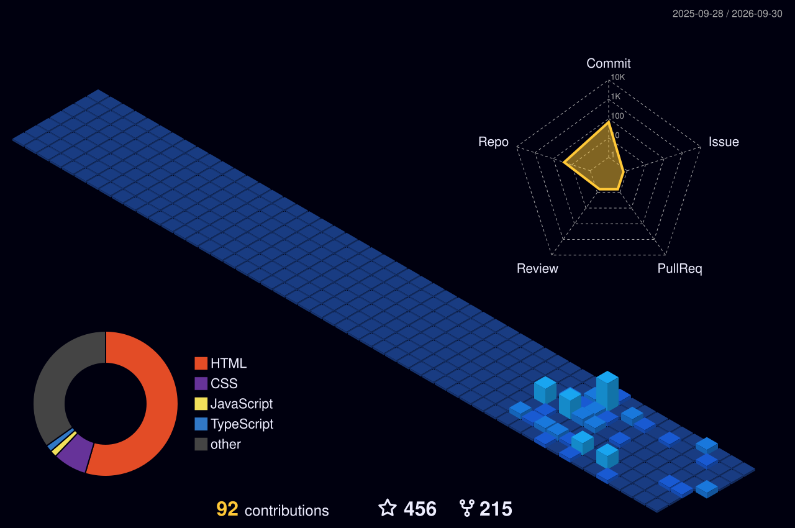

<!-- 🎬 HERO — Video viewfinder + name + cycling roles -->

  

<!-- 🧠 LEFT: What I build (Gen AI & Voice)   •   🏃 RIGHT: Life & Leadership beyond the terminal -->

  

<!-- ⚛️ TECH STACK — Orbiting core & categorized chip grid -->

  

<!-- 🪪 DEVELOPER ID + LIVE DASHBOARD -->

  

## 🚀 Featured Builds & Research

| Project | What it is | Tech Stack | Status / Stars |
| :--- | :--- | :--- | :---: |
| [**AI Chatbot with Memory**](https://github.com/mksinha01) | Context-aware RAG chatbot with persistent ChromaDB memory, custom RetrievalQA chains & automated context summarization | `LangChain` `OpenAI` `ChromaDB` `Python` | ⚡ Production |
| [**AI Avatar Counsellor**](https://github.com/mksinha01/AI_AVATAR-XP) | Real-time voice avatar for student guidance combining Pipecat audio pipelines with LangChain memory | `LangChain` `Pipecat` `OpenCV` `Python` | 🎙️ Live Demo |
| [**LiveKit Voice Agent**](https://github.com/mksinha01/livekit-frontend-with-backend-for-use-anywhere-) | Sub-second real-time voice AI agent over WebRTC via LiveKit, Pipecat audio pipeline & ElevenLabs TTS | `LiveKit` `WebRTC` `ElevenLabs` `Docker` | ⚡ Sub-second |
| [**Company Feedback AI Agent**](https://github.com/mksinha01/COMPANY-FEEDBACK-Al-AGENT) | Autonomous tool-calling agent collecting multi-channel feedback, running sentiment analysis & routing to Slack | `LangChain` `n8n` `Docker` `Slack API` | ⭐ 4 |
| [**MARK3 — Voice Assistant**](https://github.com/mksinha01/MARK3) | JARVIS-inspired real-time AI assistant powered by GroqCloud's ultra-fast LLMs (LLaMA-3) | `Python` `GroqCloud` `LLaMA-3` `Speech` | ⭐ 1 |
| [**BioAstronautics Dataset**](https://github.com/mksinha01/BioAstronautics-Dataset) | Simulated-microgravity research systematic review & n8n automated literature extraction via Groq Llama-3.3-70B | `Python` `Groq` `Llama-3.3` `n8n` | 🔬 Research |
| [**Outbound Voice Caller**](https://github.com/mksinha01/outbound-caller-python) | Autonomous voice calling agent utilizing SIP and Dispatch APIs for automated outbound conversations | `Python` `SIP API` `Dispatch` `Voice AI` | 📞 Outbound |
| [**MoneyBuddy**](https://github.com/mksinha01/MoneyBuddy) | Campus Cash Coach personal finance manager designed specifically for university students | `TypeScript` `React` `Finance` | ⭐ 2 |

 

## 🌃 My Contribution City

*Every commit builds another tower — rebuilt automatically every day.*

 

  

<!-- 💌 LET'S CONNECT -->

  

 

**Engineering intelligence with persistent memory and autonomous reasoning.** ⚡

